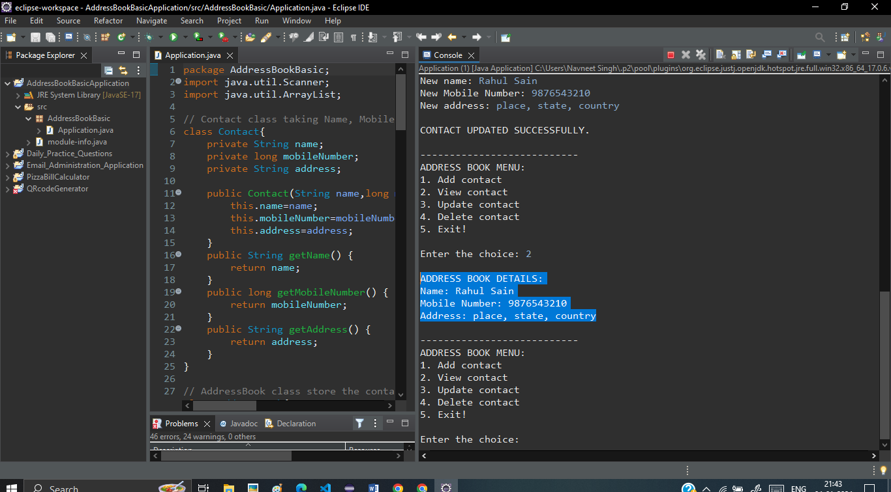

# Java Address Book Application

## Description

This Address Book Application is a basic java based program that allows users to manage their contacts. It provides the functionality to add, view, update, and delete contact information such as names, mobile numbers, and addresses.

## Features

- **Add Contact:** Users can add new contacts to the address book by providing the name, mobile number, and address.

- **View Contacts:** Users can view the list of contacts in the address book, displaying the contact's name, mobile number, and address.

- **Update Contact:** Users can update an existing contact by specifying the contact's name and providing new information (name, mobile number, and address).

- **Delete Contact:** Users can delete a contact from the address book by specifying the contact's name.

## Screenshots and Usage Process

### 1. Run on Console

### 2. For adding a contact, enter choice number "1" accoring to Adress book menu and enter name, mobile number and address of a person.

### 3. For viewing address book, enter choice number "2".

### 4. For updating a contact, enter contact name to be replaced, if this contact name exists in the Address book then enter new name, mobile number and address of a person.

### 5. For viewing changes in address book, enter choice number "2".

### 6. For Deleting an existing contact, enter contact name to be delete, if this contact name exists in the Address book then contact will deleted successfully.

### 7. For viewing changes in address book, enter choice number "2".

### 8. For Exit! the address book, enter choice number "5".

## Author 

Navneet Singh
